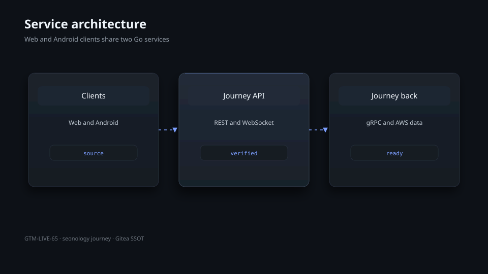
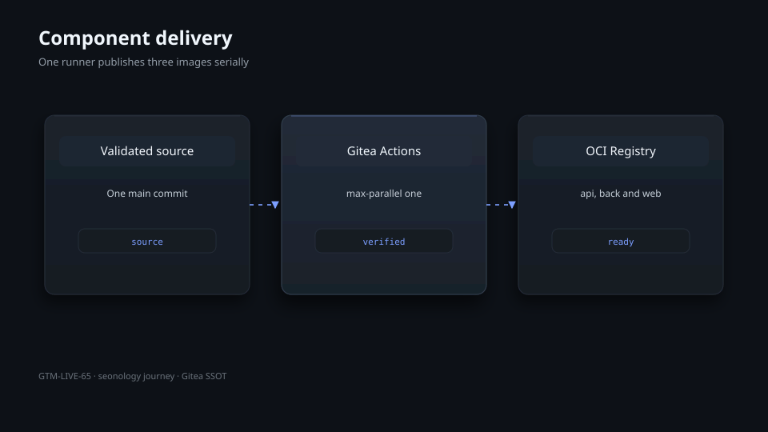
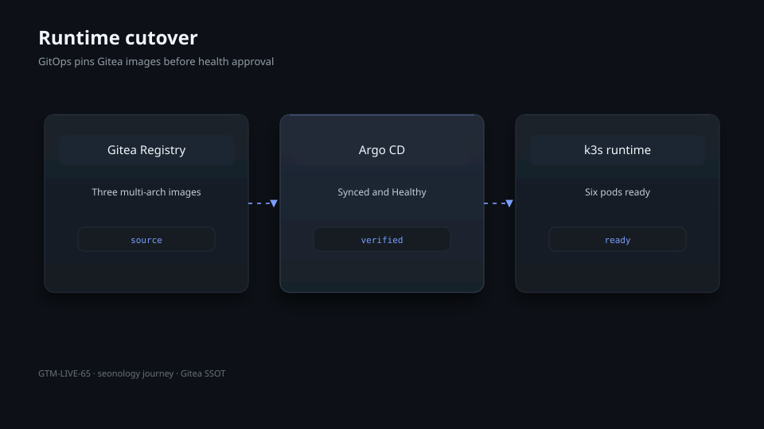
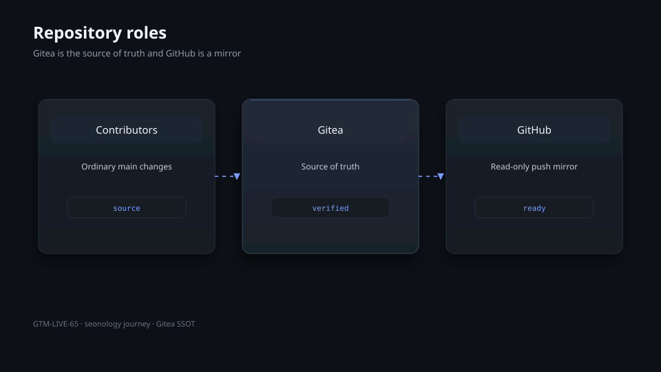

# Seonology Journey

[English](README.md) | [한국어](README.ko.md) | [日本語](README.ja.md)

Seonology Journey is a private travel planning and memory monorepo. It combines a React web client, an Android client, a REST and WebSocket API, a gRPC back service, shared Protobuf contracts, and k3s manifests.

## Architecture



The web and Android clients use the API service. The API delegates durable data and media work to the back service over gRPC. AWS DynamoDB and S3 provide production persistence.

## Components



| Path           | Role                           | Runtime output                   |
| -------------- | ------------------------------ | -------------------------------- |
| `apps/web`     | React and Vite web client      | `seonology-journey-web`          |
| `apps/api`     | REST and WebSocket edge API    | `seonology-journey-api`          |
| `apps/back`    | gRPC data and media service    | `seonology-journey-back`         |
| `apps/android` | Native Android client          | APK or AAB                       |
| `proto`        | Shared Protobuf contracts      | Generated Go and TypeScript code |
| `deploy`       | Standalone Kustomize manifests | Kubernetes resources             |

## Requirements

- Node.js 22 and pnpm 9.15.9
- Go 1.25 or later
- JDK 21 and Android SDK for Android builds
- Docker with Buildx for multi-architecture images
- `kubectl` and Kustomize for manifest validation

## Quick start

```bash
corepack enable
corepack prepare pnpm@9.15.9 --activate
pnpm install --frozen-lockfile
pnpm --filter @seonology/journey-web typecheck
pnpm --filter @seonology/journey-web test
pnpm --filter @seonology/journey-web build

cd apps/api && go test ./... && go build ./...
cd ../back && go test ./... && go build ./...
```

## Verification

```bash
python3 -m unittest tests/test_repository_contract.py
python3 verify.py
```

The verifier checks the multilingual documentation, deterministic Relief diagrams, Gitea workflow contract, preserved GitHub workflow bytes, and component builds.

## Delivery



Gitea is the source of truth. Gitea Actions validates the repository and publishes the API, back, and web images serially as `linux/amd64` and `linux/arm64` OCI indexes. GitHub is maintained as a push mirror with GitHub Actions disabled.

## Operations

The production workload is managed by the central `seonology-k3s` GitOps repository at `workloads/seonology-journey`. A release is complete only when Argo CD is Synced and Healthy, all three Deployments are Ready, image IDs point to the verified Gitea Registry digests, and internal and public health checks pass.

## Repository policy



- Use Conventional Commits with an explicit scope.
- Preserve `.github/workflows` as migration evidence.
- Store credentials only in Gitea secrets, Vault, or Kubernetes Secrets.
- Do not add automated-author signatures or emoji to project artifacts.

## License

This repository retains its existing MIT license. See [LICENSE](LICENSE).
